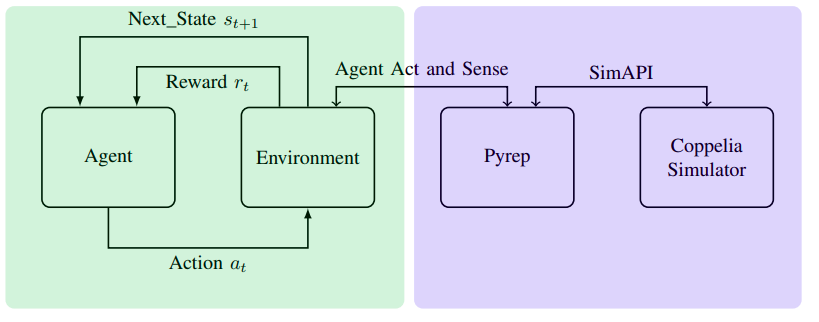
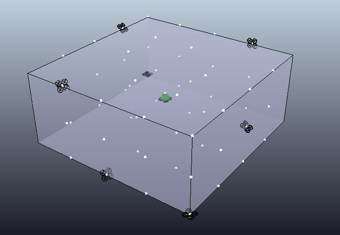

# Using Soft Actor-Critic for Low-Level UAV Control

This repository is the official implementation of [Using Soft Actor-Critic for Low-Level UAV Control](). 

<!-- >📋  Optional: include a graphic explaining your approach/main result, bibtex entry, link to demos, blog posts and tutorials -->

We train a policy using Soft Actor-Critic to control a UAV. This agent is dropped in the air, with a sampled distance and inclination from the target (the green sphere in the [0,0,0] position), and has to get as close as possible to the target. In our experiments the target always has the position = [0,0,0] and angular velocity = [0,0,0].

**Watch the video**


<!-- [](https://www.youtube.com/watch?v=9z8vGs0Ri5g) -->

<p align="center">
  <a href="https://www.youtube.com/watch?v=9z8vGs0Ri5g" title="Watch the Video">
    
  </a>
</p>


**Framework**
It is a traditional RL env that accesses the Pyrep plugin, which accesses Coppelia Simulator API. It is a lot faster than using the Remote API of Coppelia Simulator, and you also have access to a simpler API for manipulating/creating objects inside your running simulation.

<!--  -->

<p align="center">
  
</p>

**Initial positions for the UAV agent**

<!--   -->

<p align="center">
  
</p>


## Requirements/Installing

### Docker

One of the safest ways to emulate our environment is by using a Docker container. This approach is better to train in a cluster and have a stable environment, although forwarding the display server with Docker is always tricky (we leave this one to the reader). 

Change the container's variables and then use the Makefile to make it easier to use our Docker Container. The commands are self-explanatory.

**create-image**

```creating-image
make create-image
```

**create-container**

```creating-container
make create-container
```
**training**

```training-an-agent
make training
```

**evaluate-container**

```evaluate
make evaluate-container
```


### Without-Docker

1) Install Coppelia [Coppelia Simulator](https://www.coppeliarobotics.com/)
2) Install Pyrep [Pyrep](https://github.com/stepjam/PyRep)
3) Install Drone_RL [Drone_RL](https://github.com/larocs/Drone_RL)
4)To install requirements:

```setup
pip install -r requirements.txt
```

4) To install this repo:
```setup
python setup.py install
```


<!-- 
>📋  Describe how to set up the environment, e.g., pip/conda/docker commands, download datasets, etc... -->

## Training

To train the model(s) in the paper, run this command:

```train
./training.sh
```


*Is somewhat tricky to train an exact policy, because that is a variability inherent to off-policy models and reward-shaping to achieve optimal control politics for Robotics.*

*One hack that alleviates this problem is save something like a moving-window of say 5-10 policies and pick the best one (qualitatively) after a particular reward stabilization. More research is needed to alleviate the need for qualitative assessment of the trained policies.*


## Evaluation

To evaluate my model with the optimal policy, run:

```eval
./evaluate.sh
```

<!-- >📋  Describe how to evaluate the trained models on benchmarks reported in the paper, give commands that produce the results (section below). -->

## Pre-trained Models

You can check the saved trained policies in:

- [saved_policies/](saved_policies/) 

<!-- >📋  Give a link to where/how the pretrained models can be downloaded and how they were trained (if applicable).  Alternatively, you can have an additional column in your results table with a link to the models. -->


## Results

Run the notebooks on [notebooks/](notebooks/) to check the images presented on the paper. 

[results](notebooks/README.md)

## Credits

Code heavily based in [RL-Adventure-2](https://github.com/higgsfield/RL-Adventure-2)

The environment is a continuation of the work in:

    G.  Lopes,  M.  Ferreira,  A.  Sim ̃oes,  and  E.  Colombini,  “Intelligent Control of a Quadrotor with Proximal Policy Optimization,”Latin American Robotic Symposium, pp. 503–508, 11 2018

<!-- ### [Image Classification on ImageNet](https://paperswithcode.com/sota/image-classification-on-imagenet)

| Model name         | Top 1 Accuracy  | Top 5 Accuracy |
| ------------------ |---------------- | -------------- |
| My awesome model   |     85%         |      95%       |

>📋  Include a table of results from your paper and link back to the leaderboard for clarity and context. If your main result is a figure, include that figure and link to the command or notebook to reproduce it. 
 -->

## License

[MIT-LICENSE](License.md)

## Cite us

